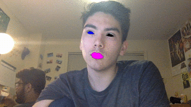

# Case Study: OpenCV  
## Technology and Platform used for Development  
### What coding languages are used? Do you think the same languages would be used if the project was started today? What languages would you use for the project if starting it today?  

OpenCV is built in C++. C++ is a good choice for OpenCV because as a computer vision and machine learning library it demands high performance, and C++ is one of the best performant high level languages. OpenCV was originally started in 1999 which also explains why it was built in C++. I think that if the project was restarted today they would probably place more focus on Python because Python has become one of the leading languages in computer vision(?) and machine learning since 1999. Currently OpenCV does support Python and other languages but more of their focus seems to be on C++. For my case study I used the Python library for OpenCV.

### What build system is used (e.g. Bazel, CMake, Meson)? What build tools / environment are needed to build (e.g. does it require Visual Studio or just GCC or ?)  

OpenCV uses CMake as its build system.

### What frameworks / libraries are used in the project? At least one of these projects don’t use any external libraries or explicit threading, yet is noted for being the fastest in its category--in that case, what intrinsic language techniques is it using to get this speed.

OpenCV takes advantage of many third party libraries. A lot of these libraries just make it easier to work with images. OpenCV also has a lot of optional third party libraries such as FFMPEG that are required for some features, but if you do not want to use these features you don't need these libraries.

## Testing: describe unit/integration/module tests and the test framework
For unit testing, OpenCV uses the Google Test framework. The same tests are done on all supported platforms i.e. Windows, MacOS, Linux, Android and the majority of testing is done using the C++ API. OpenCV runs two types of tests: accuracy tests and performance tests. Accuracy tests run OpenCV functions with different parameters and check it against a reference output. These tests are to ensure that OpenCV is consistent across platforms with different hardware and software. Performance tests ensure that the software can handle a specific workload. 
### How are they ensuring the testing is meaningful? Do they have code coverage metrics for example?
I think that the Google Test framework includes code coverage in their testing so OpenCV probably uses this.
### What CI platform(s) are they using (e.g. Travis-CI, AppVeyor)?
OpenCV uses their own system for Continuous Integration called [BuildBot](http://pullrequest.opencv.org). 
### What computing platform combinations are tested on their CI? E.g. Windows 10, Cygwin, Linux, Mac, GCC, Clang
Not sure
## Software architecture in your own words, including:
### How would you add / edit functionality if you wanted to? How would one use this project from external projects, or is it only usable as a standalone program?

### What parts of the software are asynchronous (if any)?

### Please make diagrams as appropriate for your explanation

### How are separation of concerns and information hiding handled?

### What architectural patterns are used

### Does the project lean more towards object oriented or functional components

## Analyze two defects in the project--e.g. open GitHub issue, support request tickets or feature request for the project
One issue that I had with the project was the `cv2.destroyAllWindows()` function did not work for me when I was running my code in a Jupyter Notebook. After the video finished playing I would have to manually force-quit the playback window, which would cause my kernel to die. 

One defect posted as a [GitHub Issue](https://github.com/opencv/opencv/issues/5150) is that the Python package crashes when used with the multiprocessing package on OSX. 
### Does the issue require an architecture change, or is it just adding a new function or?

### make a patch / pull request for the project to fix problem / add feature

## Demonstration Application of the system
For my demonstration I made an application that will track the user's face via the webcam and identify facial landmarks i.e. mouth, nose, eyes. After identifying the eyes and mouth the application will color the eyes and mouth. A gif of the result can be seen here.  
  

In my code I imported the OpenCV library for Python and used `cv2.videoCapture()` and `cv2.imshow()` to capture and display video from the user. I used a different computer vision library, dlib, to do create and train a model for face and facial landmark detection. To draw the eyes and mouth effects, I used PIL, an image processing library.
